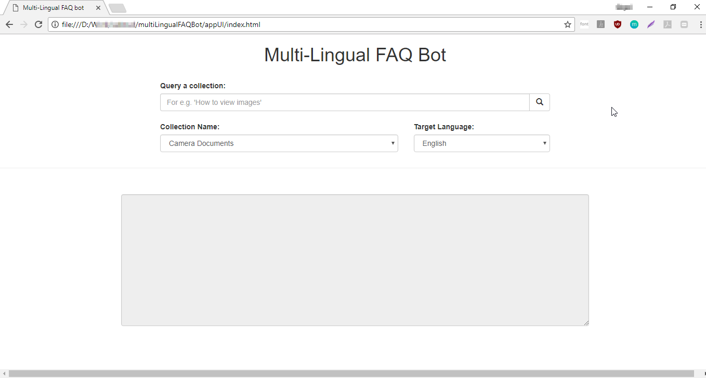
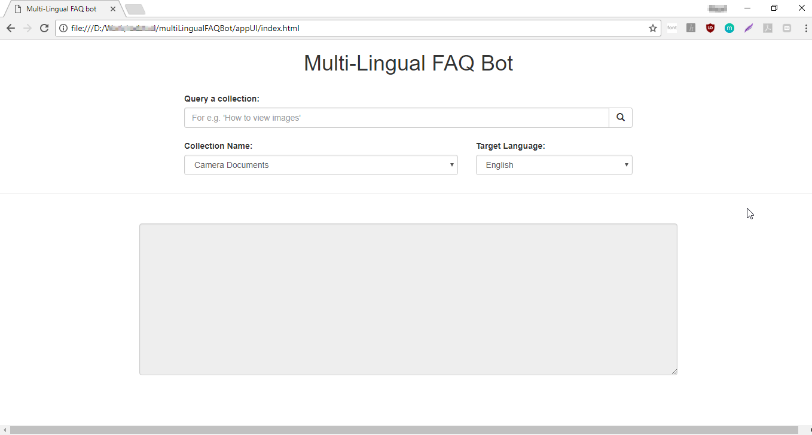
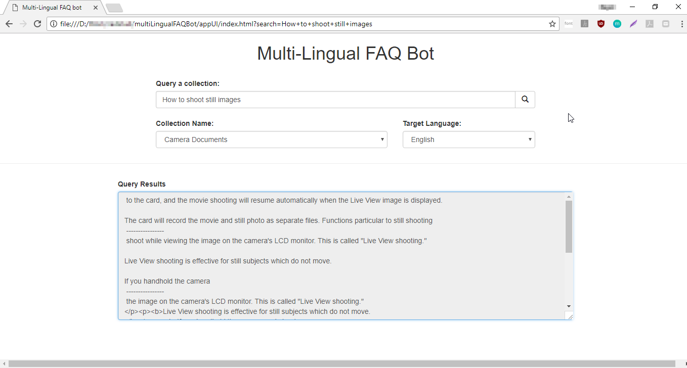
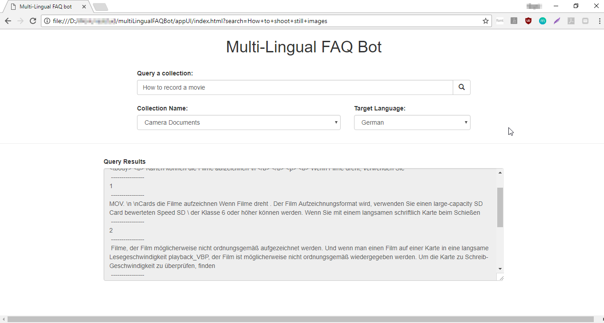
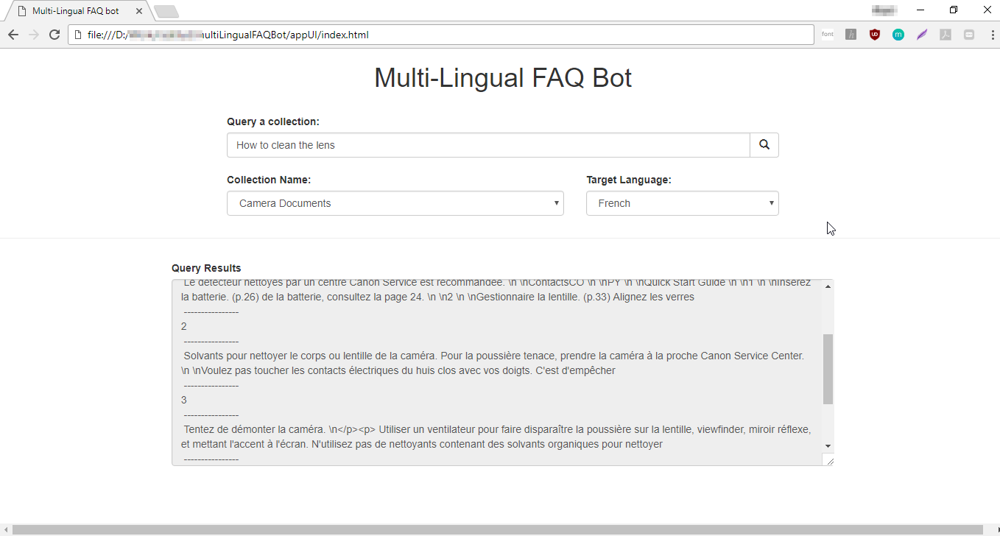
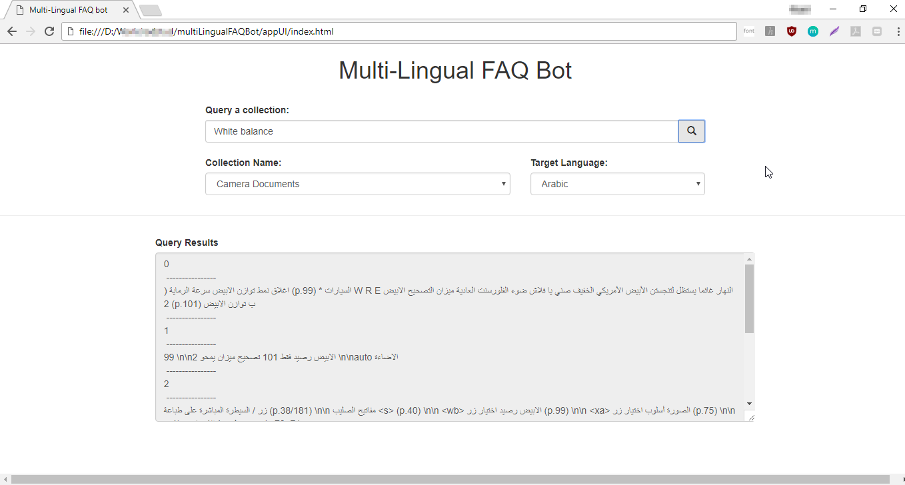

### MultiLingual FAQBot powered by IBM Watson Discovery Service, Language Translator service and PubNub

This repository contains the source code and instructions to build a MultiLingual FAQBot which is an automated product FAQ search engine. It uses IBM Watson Discovery API to analyze the product's user guide, Watson Language Translator to translate the text obtained from discovery service and a local client side web page to provide the user interface for querying the product user guide via discovery service.

For this demo app, user guide for Canon EOS550D is used as an example here. Watson Disovery service parses the user guide (in PDF) format and and provides a searchable database via queries in natural language. A local client side web page (along with some javascript code) provides the interface to query the database and also select a language for translating the query answers. The query answers are shown in the form of passages of text retrieved by Watson Discovery service.

Watson Language service provides the translation of query answers to be shown on the client side web page. The languages provided are - German, French and Arabic along with default English language.

#### Prerequisites
Before you get started with this app, you need your own [IBM ID](https://console.bluemix.net/) and a developer account on [PubNub](https://admin.pubnub.com). Once you have created these accounts, follow the steps below to build and run this app.

#### Setup

This app is hosted within IBM Cloud and PubNub so no local setup or installation is necessary. However, the services need to be created and configured on IBM Cloud and PubNub. This README file contains the instructions for setting up the services for hosting the demo app.

Clone this repository first.

Here are the services required to be configured and link to instructions to setup the services. Follow the order as mentioned below.

* [Setup Watson Discovery Service](setup-discovery.md)

* [Setup Watson Language Translator Service](setup-translator.md)

* [Setup PubNub Function](setup-pubnub.md)

#### Run the app

The app is a standalone webpage with some javascript code. Open the file [index.html](appUI/index.html).

The webpage offers an interface to query the discovery services document collection.

* A text box with a search icon where you can type in your query.

* A drop-down box which gets populated  with the available collections from the Watson discovery service, when the page loads.

* A drop-down with choice of language for answers. The choices are English, German, French and Arabic.

* A text area to show answers received from Watson Discovery service.

After loading the webpage, Collection Name drop-down box gets populated with the collection created earlier while configuring Discovery services.

Type in your query in the search box and the text area shows the answers. You can try different languages and different questions related to camera. The file [sampleQuestions.txt](documents/sampleQuestions.txt)  lists a few relevant questions you can try out.

Here are a few screenshots.

Have fun developing with Watson !
