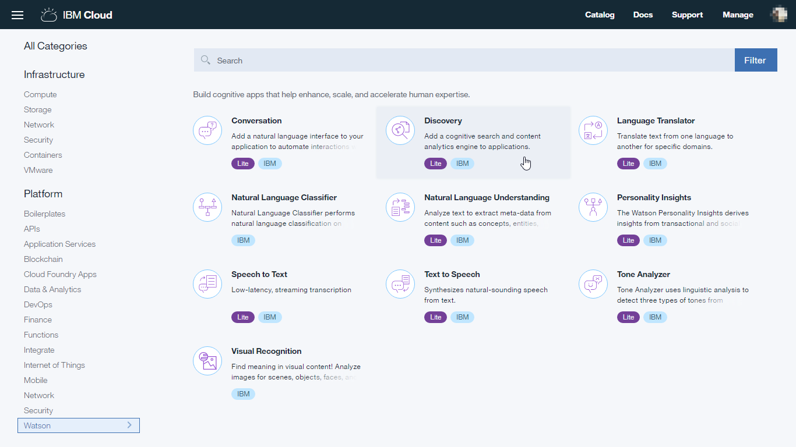
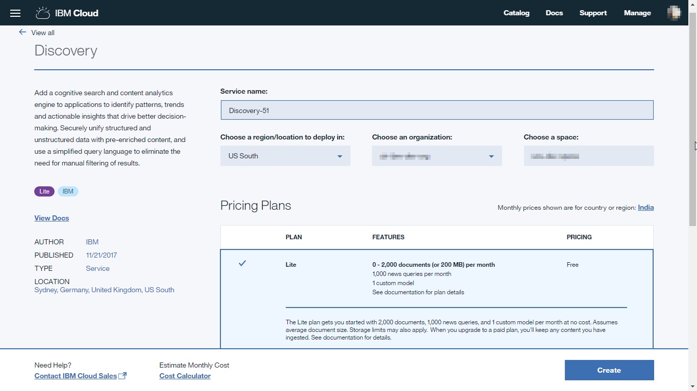
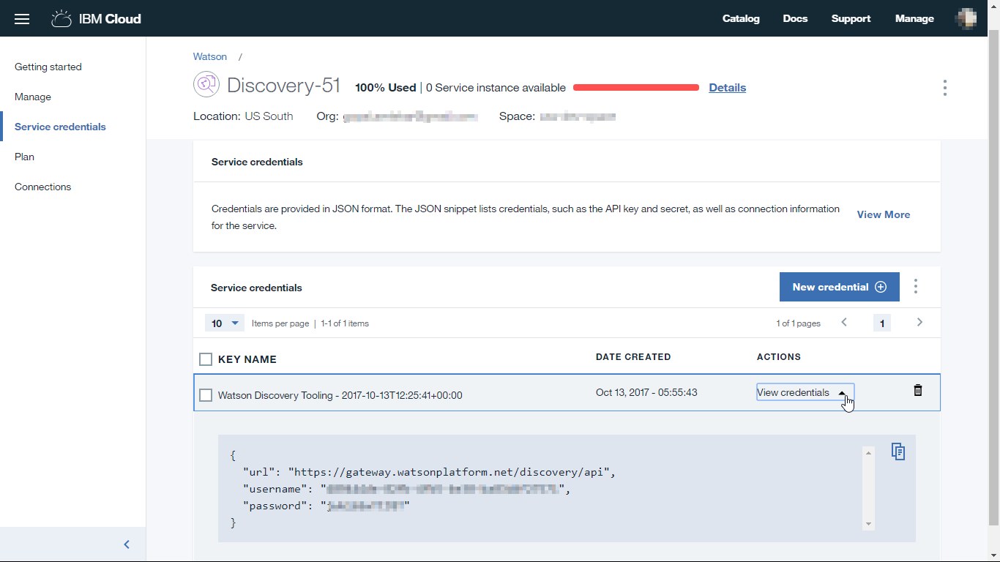
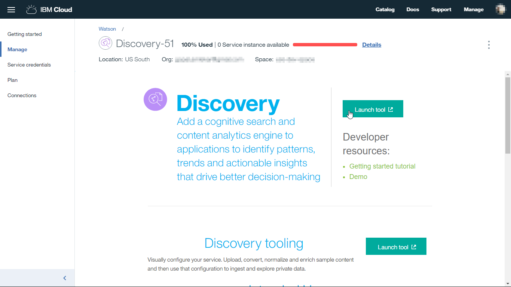
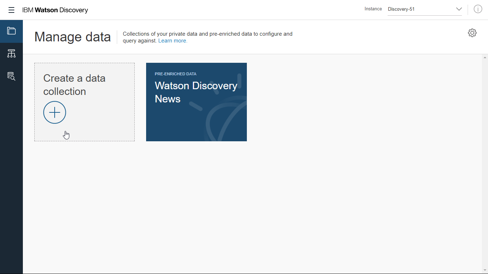
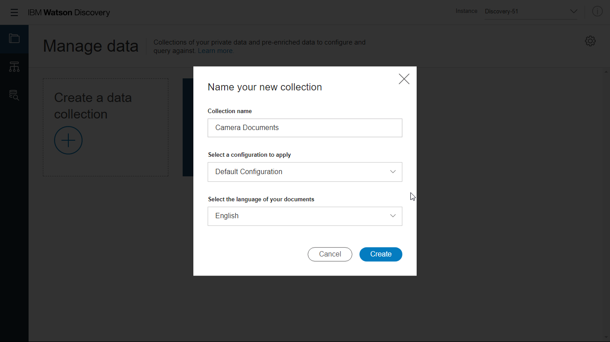
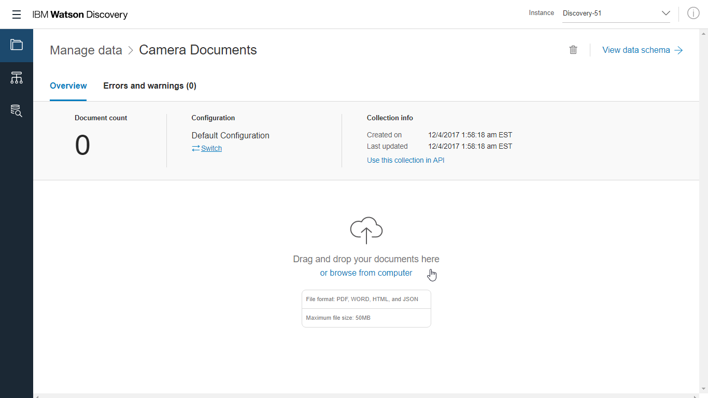
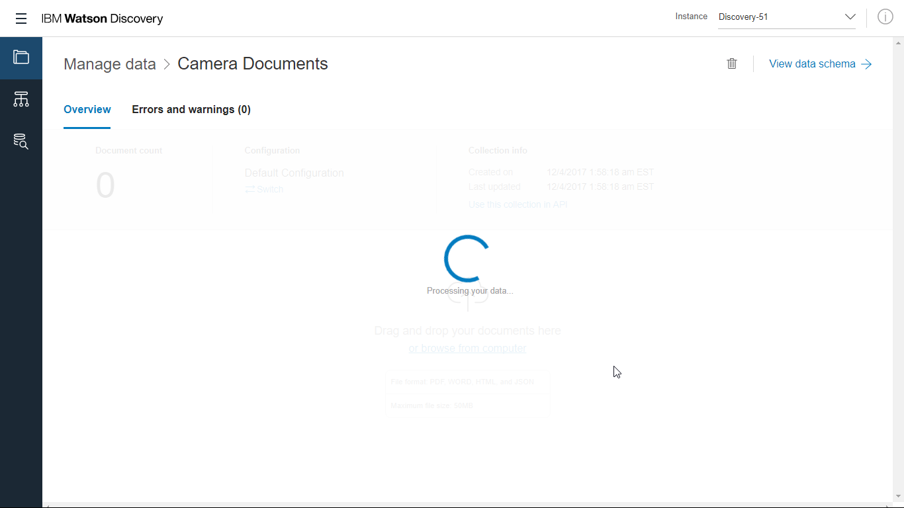
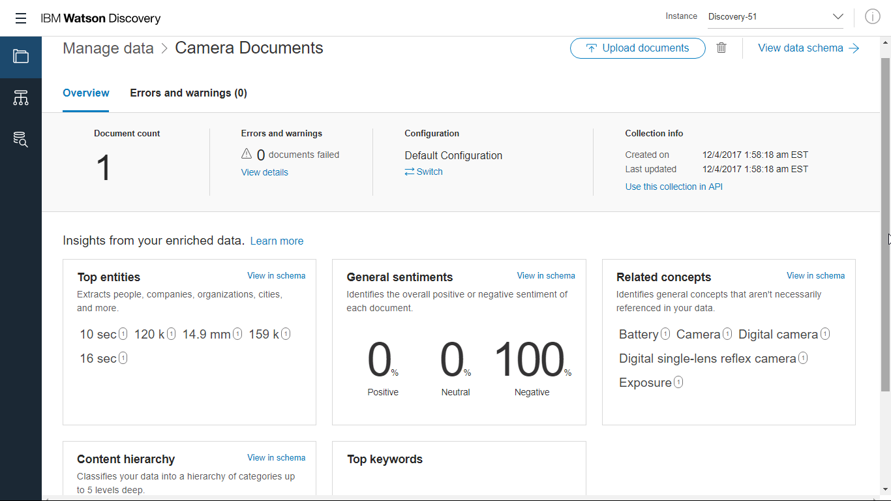
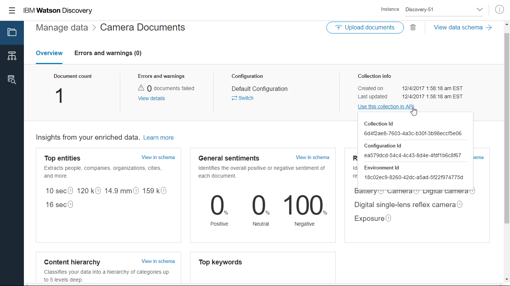

### How to create and configure Watson Discovery Service

#### Setup

Before you can create Watson Discovery Service, you need your own [IBM ID](https://console.bluemix.net/).  Once you have created the account, follow the steps below.

#### Create Watson Discovery Services

##### Step 1

Log on to [IBM Cloud](https://console.bluemix.net/) with your IBM ID. Go to catalog, then select **Discovery** under Watson services.

##### Step 2

Enter a name for the service. Leave the pricing plan to 'Lite' and click on 'Create' button in the bottom right corner.

##### Step 3

Once the service is created, from the service page, go to 'Service credentials' and click on 'View credentials'. It will show a json object with url, username and password for your service.
The username and password are unique to your service instance created. Make note of these as we will use them later while setting up the PubNub function.

The Watson Discovery Service is created now. Let's configure it and upload documents to the service.

#### Configure Watson Discovery Services

##### Step 4

From the service page, go to 'Manage' and click on 'Launch Tool'. This will launch the discovery service tooling and management page in another browser tab.

##### Step 5

You can see that the discovery service comes with a pre-configured and pre-enriched collection named 'Watson Discovery News'.

We need to add our own documents to a collection. A collection is simply a set of documents. Collection helps you in differentiating your documents. For example, you can create different collections for different products so as to narrow down the search to most relevant documents.

Let's create a new collection first. Click on 'Create a Data Collection'.

##### Step 6

On the popup screen, give a name to your collection, leave the configuration to default and language to English.

*Note: Please make sure the language choice matches the language of documents uploaded. In this case, we are uploading the camera user guide which is in English language.*

##### Step 7

With the collection created, we can now add our documents to this collection. Either drag and drop the [camera user guide document](documents/eosrt2i-eos550d-im-en.pdf) or click on 'browse from computer' and select the document to upload.

*Note: You can create a new configuration and edit the enrichments to be applied to your documents. To create a new configuration, click on 'Switch' under the configuration tab and then follow instructions on the popup screens. Keep in mind that configuration changes, if required, must be done before uploading any documents. However, for this tutorial we are using the default configuration*

The process will take a while as Watson analyzes the document and applies enrichments to the data for querying.

##### Step 8

When the upload and analysis of the document is completed, Watson will show the insights it has found in the document. These insights include top entities, concepts, keywords and general sentiments found in the document.

##### Step 9

As a final step in this configuration process, we need the collection details to be used in our code later. Click on 'Use this collection in API' which will show the collection id, environment id and configuration id. We are going to need the collection id and environment id so go ahead and copy them. We will use them later while configuring the PubNub function.

This completes the creation and configuration of Watson Discovery Service.
