### How to setup PubNub and create function within pubnub

#### Setup

Before you can create and configure PubNub function, you need a developer account on [PubNub](https://admin.pubnub.com). Once you have created the account, follow the steps below.

###### Step 1:

Login to [PubNub admin portal](https://admin.pubnub.com) with your PubNub account.

###### Step 2:

From the dashboard, create a new app by clicking on 'CREATE NEW APP +' and give some name to your app.

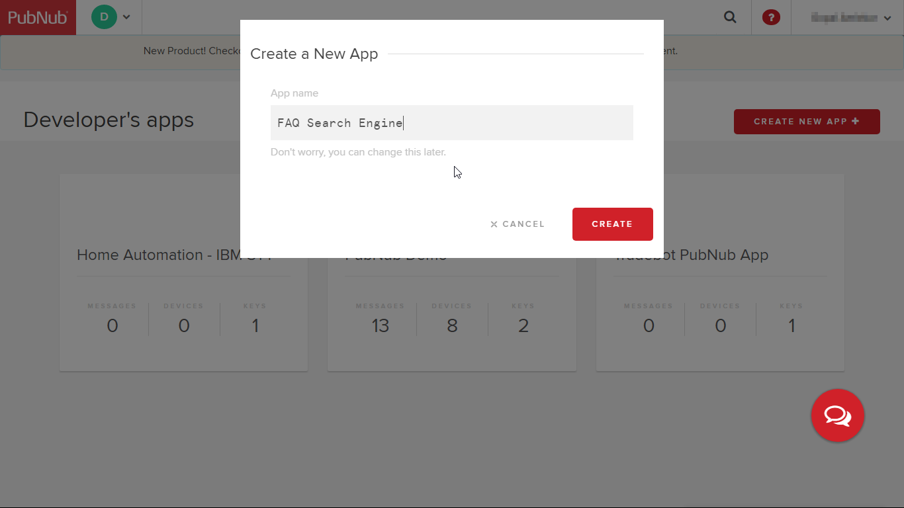

###### Step 3:

Your PubNub app is created now.

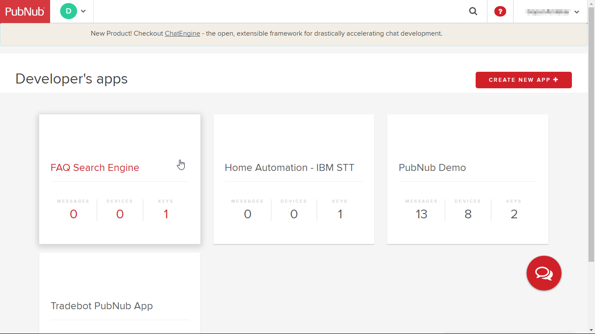

Click on this newly created app. A demo keyset is already created for you.

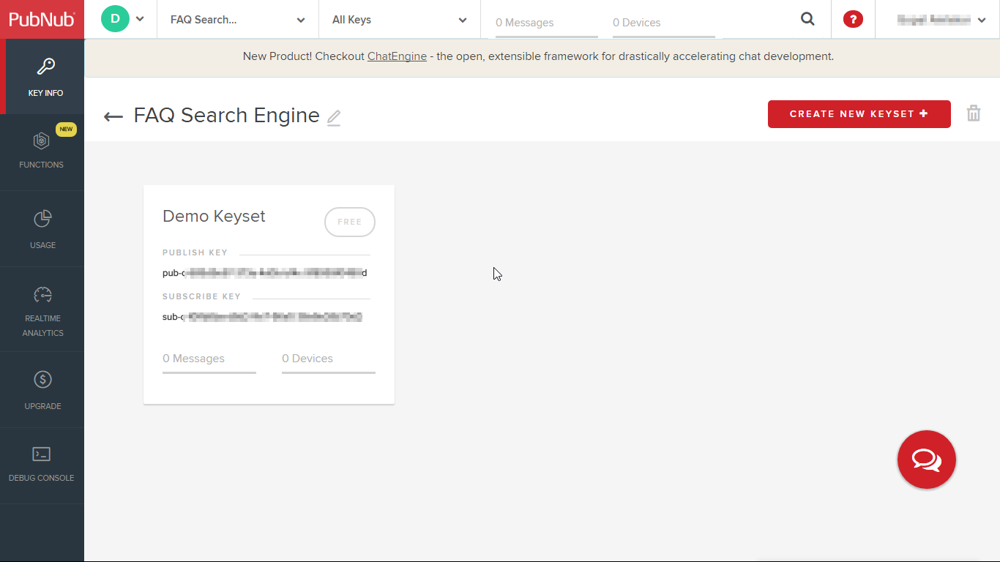

Click on the keyset and copy both the publish and subscribe keys. We will need them while running the FAQBot later.

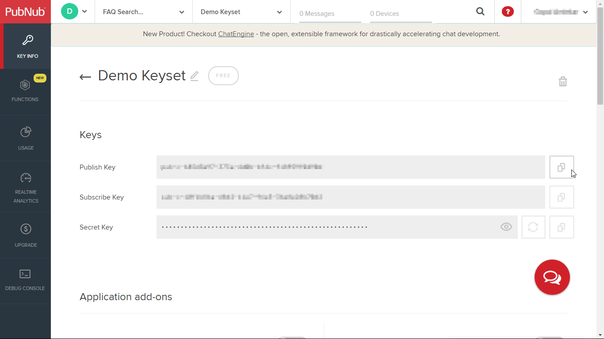

#### Step 4:

Let's now create a function microservice in PubNub to host the code for accessing Watson services.

Click on 'FUNCTIONS' (on the left side bar).

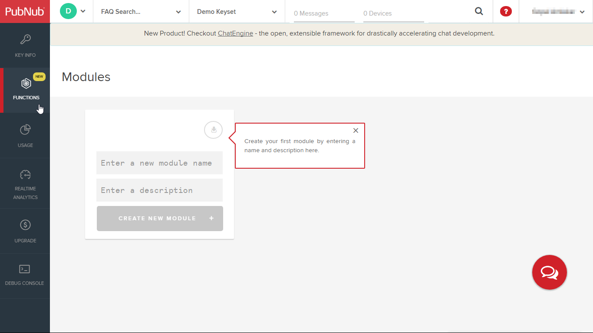

There are no modules for the newly created app yet. We first need to create a module within the app to host function code.

Give some name and description for your new module. Leave the keyset as default and click on 'CREATE NEW MODULE' button.

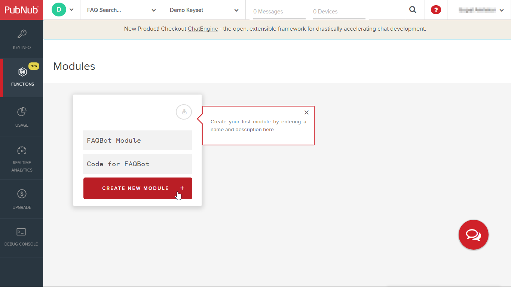

The module is created now. In the next step, we will create a function and add our code to it.

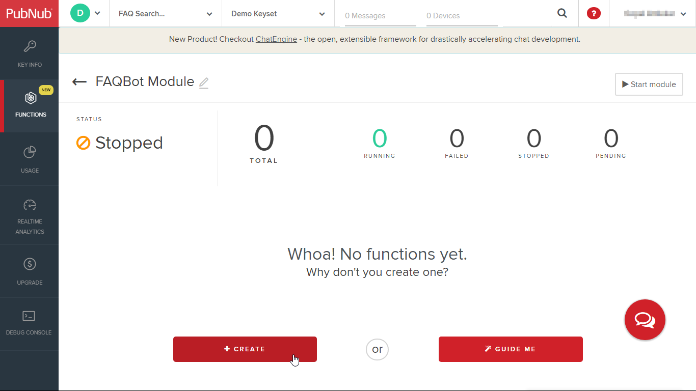

#### Step 5:

Create a new function by clicking on '+ CREATE' button on the screen for the module created earlier. On the popup screen, give a name to the function. Select the trigger as 'Before Publish or Fire' and enter the channel name as 'faqbot_req_resp'.

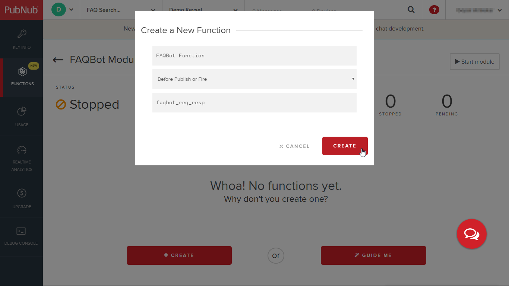

*Note: It is important to keep this channel name same as we are using the same name in our client side code.*

#### Step 6:

The newly created function shows some default code in it.

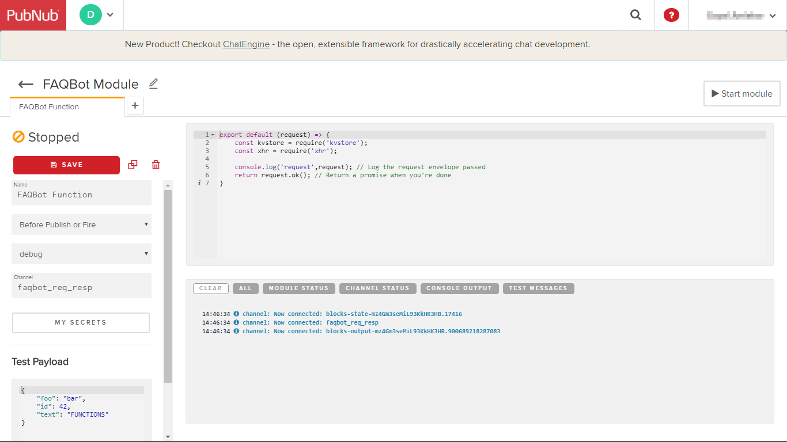

Replace the default code with contents of the [PubNub Function code](pubnub/watson_function.js)

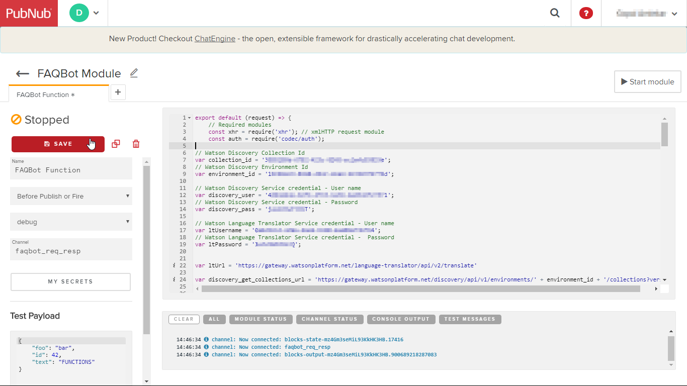

#### Step 7:

In this function code, you will need to put in your own credentials obtained from the IBM Watson services.

* On lines 7 and 9 respectively, add in the collection id and environment id respectively. These ids were obtained in step 9 of [Discovery Setup](setup-discovery.md).

* On lines 12 and 14 respectively, add in the service credentials obtained for Watson Discovery Service in step 3 of  [Discovery Setup](setup-discovery.md).

* On lines 17 and 19 respectively, add in the service credentials obtained for Watson Language Translator Service in step 4 of  [Language Translator Setup](setup-translator.md).

*Note: The service credentials are different from your IBM ID and password*

#### Step 8:

Click on 'SAVE' (on left side) and then click on 'Start module' to start running the function.

You should see the messages in the console about the function block being deployed globally.

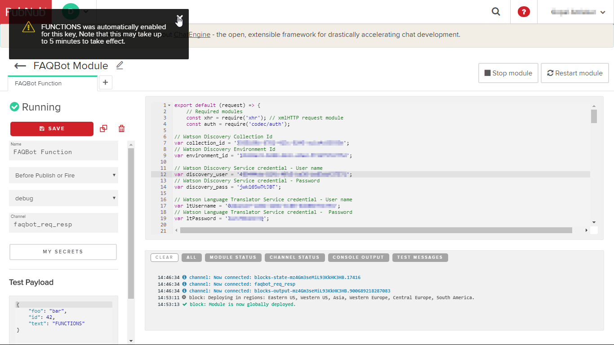

This completes the setup of PubNub function block.
