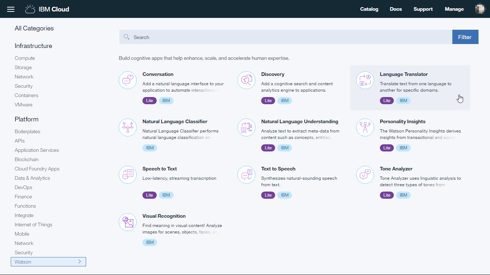
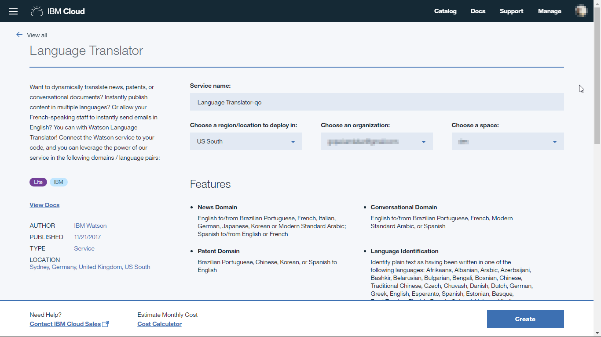
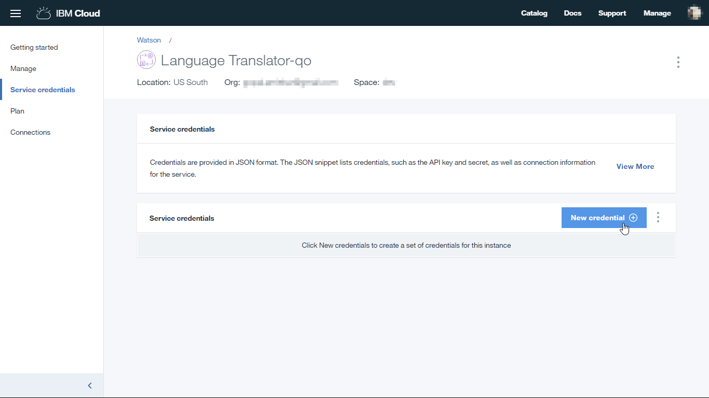
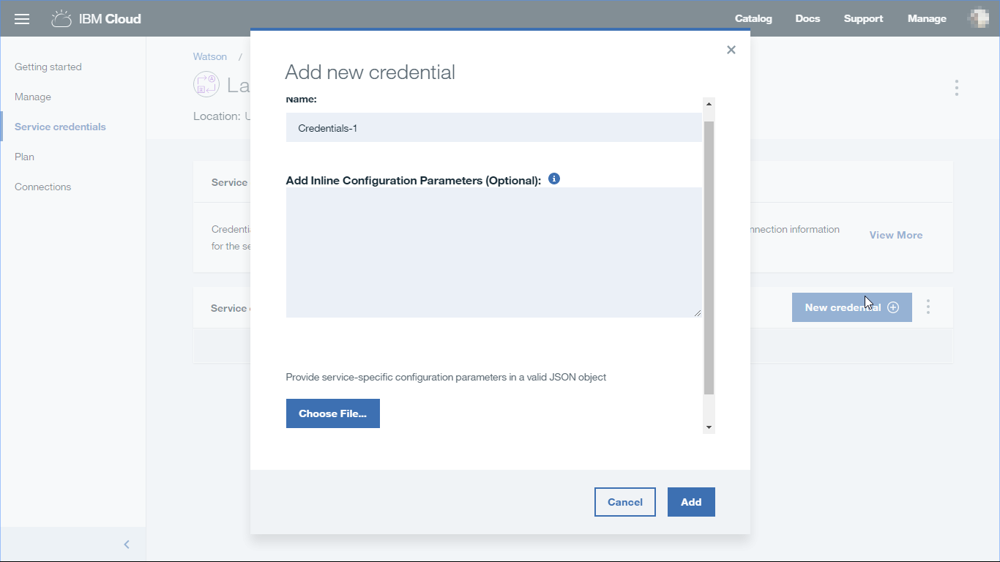
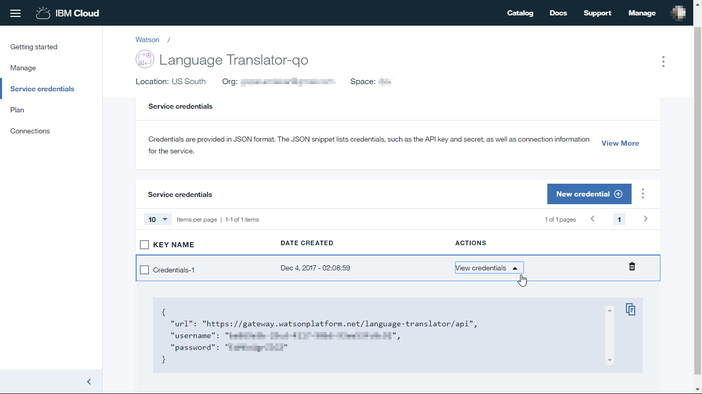

### How to create Watson Translator Service

#### Setup

Before you can create Watson Language Translator Service, you need your own [IBM ID](https://console.bluemix.net/).  Once you have created the account, follow the steps below.

#### Create Watson Language Translator Service

##### Step 1

Log on to [IBM Cloud](https://console.bluemix.net/) with your IBM ID. Go to catalog, then select **Language Translator** under Watson services.

##### Step 2

Enter a name for the service. Scrolling down, leave the pricing plan to 'Lite' and click on 'Create' button in the bottom right corner.

##### Step 3

Once the service is created, from the service page, go to 'Service credentials'. We need to create new credentials so click on 'New credential' button.

On the popup screen, enter a name for the credentials and leave other things default. Click on 'Add' button on the popup screen. Watson will create a new set of credentials for the Language Translator service for you.

##### Step 4

On the service page, click on 'View credentials' which will show a json object with url, username and password for your service.
The username and password are unique to your service instance created. Make note of these as we will use them later while setting up the PubNub function.

This completes the creation of Watson Language Translator Service. There is no need to configure it specifically for our tutorial.
